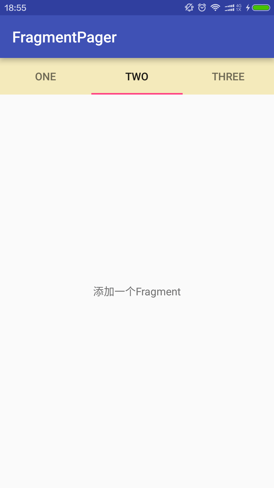

# Fragment & ViewPager & TableLayout的封装

gradle依赖

```
    compile 'cn.alien95:fragmentpager:0.1.0'
```

### 使用方法

#### FragmentPager的使用

xml布局文件

```xml
<cn.alien95.view.FragmentPager
    android:id="@+id/fragment_pager"
    android:layout_width="match_parent"
    android:layout_height="match_parent"
    app:tab_background="#f4eabb"/>
```

java代码

```
  fragmentPager = (FragmentPager) findViewById(R.id.fragment_pager);
  fragmentPager.setFragmentManager(getSupportFragmentManager());
  fragmentPager.setTitles("ONE","TWO","THREE","FOUR","FIVE","SIX");
  fragmentPager.addFragment(new TestFragment(),new TestFragment(),new TestFragment());
```

如果要对TableLayout进行相关的设置

```
  fragmentPager.getTabLayout();   //获取到TableLayout
```

#### BaseAdapter的使用

如果不需要TableLayout，你可以直接使用BaseAdapter来实现Fragment & ViewPager

```
  adapter = new BaseAdapter(fragmentManager);
  viewPager.setAdapter(adapter);
```

### [Demo](https://github.com/llxdaxia/FragmentPager/tree/dev/app)

